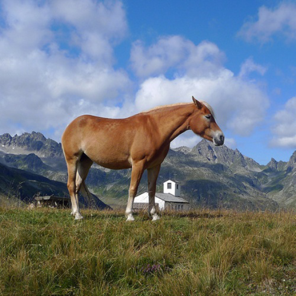

<h1 align="center">UltraEdit</h1>

<p align="center">

<a href="https://arxiv.org/abs/2407.05282">
</a>

<a href="https://huggingface.co/spaces/jeasinema/UltraEdit-SD3">
    
</a>

<a href="https://huggingface.co/datasets/BleachNick/UltraEdit">
    
</a>

<a href="https://ultra-editing.github.io/">
    
</a>

<a href="https://huggingface.co/BleachNick/SD3_UltraEdit_w_mask">
    
</a>

</p>

This repository contains code, models, and datasets for UltraEdit.

## Introduction
**UltraEdit**, a large-scale (~4M editing samples), automatically generated dataset for instruction-based image editing. Our key idea is to address the drawbacks in existing image editing datasets like InstructPix2Pix and MagicBrush, and provide a systematic approach to producing massive and high-quality image editing samples. 

**UltraEdit** offers several distinct advantages:  

1. It features a broader range of editing instructions by leveraging the creativity of large language models (LLMs) alongside in-context editing examples from human raters.  
2. Its data sources are based on real images, including photographs and artworks, which provide greater diversity and reduced bias compared to datasets solely generated by text-to-image models.  
3. It also supports region-based editing, enhanced by high-quality, automatically produced region annotations.  

Our experiments show that canonical diffusion-based editing baselines trained on **UltraEdit** set new records on various benchmarks. 
Our analysis further confirms the crucial role of real image anchors and region-based editing data.

## Training

**Setup: ** 

```
pip install -r requirements

cd diffusers && pip install -e .
```

### Training with stable-diffusion3

**Stage 1: Free-form image editing**

```shell
bash scripts/run_sft_512_sd3_stage1.sh
```

**Stage 2: Mix training**

```shell
bash scripts/run_sft_512_with_mask_sd3_stage2.sh
```

### Training with stable-diffusion-xl

**Stage 1: Free-form image editing**

```shell
bash scripts/run_sft_512_sdxl_stage1.sh
```

[//]: # (**Stage 2: Mix training**)

[//]: # ()
[//]: # (```shell)

[//]: # (bash scripts/run_sft_512_with_mask_sd3_stage2.sh)

[//]: # (```)


### Training with stable-diffusion1.5

**Stage 1: Free-form image editing**

```shell
bash scripts/run_sft_512_sd15_stage1.sh
```

**Stage 2: Mix training**

```shell
bash scripts/run_sft_512_with_mask_sd15_stage2.sh
```

## Example
Below is an example of how to use our pipeline for image editing. Given an input image and a mask image, the model can generate the edited result according to the provided prompt.

<p float="left">
  
  
  
</p>

```python
# For Editing with SD3
import torch
from diffusers import StableDiffusion3InstructPix2PixPipeline
from diffusers.utils import load_image
import requests
import PIL.Image
import PIL.ImageOps
pipe = StableDiffusion3InstructPix2PixPipeline.from_pretrained("BleachNick/SD3_UltraEdit_w_mask", torch_dtype=torch.float16)
pipe = pipe.to("cuda")
prompt="What if the horse wears a hat?"
img = load_image("input.png").resize((512, 512))
mask_img = load_image("mask_img.png").resize(img.size)
# For free form Editing, seed a blank mask
# mask_img = PIL.Image.new("RGB", img.size, (255, 255, 255))
image = pipe(
    prompt,
    image=img,
    mask_img=mask_img,
    negative_prompt="",
    num_inference_steps=50,
    image_guidance_scale=1.5,
    guidance_scale=7.5,
).images[0]
image.save("edited_image.png")
# display image
```


[//]: # ()
[//]: # (## License)

[//]: # ()
[//]: # (This project is licensed under the terms of the MIT license. See the [LICENSE]&#40;LICENSE.md&#41; file for details.)

[//]: # ()
[//]: # (## Contact)

[//]: # ()
[//]: # (For any questions or issues, please open an issue on GitHub or contact us at support@example.com.)